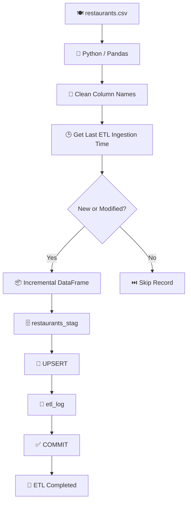
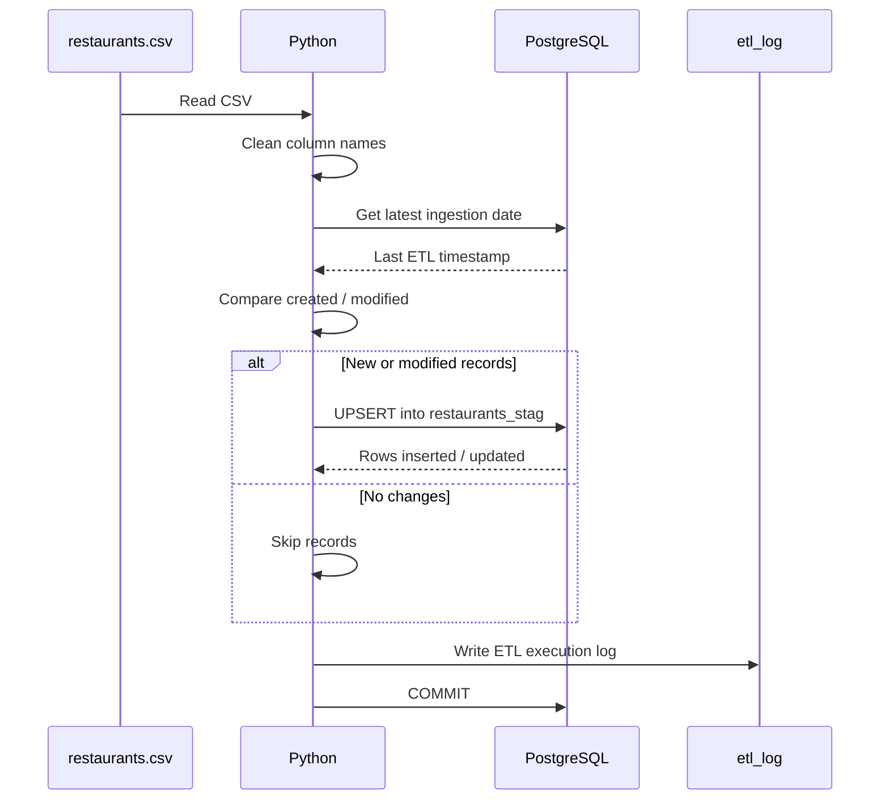

# 🍽️ Restaurant Incremental ETL Pipeline

### Python + PostgreSQL | Incremental Loading | UPSERT | ETL Logging

[](https://www.python.org/)
[](https://www.postgresql.org/)
[](https://pandas.pydata.org/)
[](https://www.psycopg.org/)


> A Python and PostgreSQL incremental ETL pipeline that reads restaurant data from CSV, identifies newly created and modified records, loads only incremental records into a staging table, performs UPSERT operations, and maintains an ETL execution log.

---
## 📌 Table of Contents

- [🎯 Project Overview](#-project-overview)
- [🏗️ Architecture](#️-architecture)
- [💡 Why Incremental Loading](#-why-incremental-loading)
- [📂 Source Data](#-source-data)
- [🗄️ Database Design](#️-database-design)
- [🔄 ETL Workflow](#-etl-workflow)
- [📈 Incremental Loading Logic](#-incremental-loading-logic)
- [🔁 UPSERT / SCD Type 1](#-upsert--scd-type-1)
- [📝 ETL Logging](#-etl-logging)
- [🛡️ Error Handling](#️-error-handling)
- [📁 Project Structure](#-project-structure)
- [⚙️ Installation](#️-installation)
- [🔐 Environment Variables](#-environment-variables)
- [▶️ Running the Pipeline](#️-running-the-pipeline)
- [📊 Example Output](#-example-output)
- [🎓 Key Data Engineering Concepts](#-key-data-engineering-concepts)
- [🚀 Future Improvements](#-future-improvements)
- [👨‍💻 Author](#-author)

---

## 🎯 Project Overview

This project implements an **incremental ETL pipeline** using Python, Pandas, and PostgreSQL.

The source file contains restaurant information along with:

- `created`
- `modified`

timestamps.

Instead of loading the complete source dataset during every execution, the pipeline identifies only records that are:

- newly created, or
- modified since the previous ETL run.

Only those records are loaded into the PostgreSQL staging table.

The pipeline also maintains an `etl_log` table that records the execution time of the staging ETL process.

---

## 🏗️ Architecture



---

# 💡 Why Incremental Loading?

A traditional full load processes every record during every execution.

### ❌ Full Load

```text
Run 1 → 100,000 rows
Run 2 → 100,000 rows
Run 3 → 100,000 rows
```

If only 200 records changed, processing all 100,000 records again is inefficient.

### ✅ Incremental Load

```text
Run 1 → 100,000 rows
Run 2 → 200 rows
Run 3 → 75 rows
```

Only new or modified records are processed.

### Benefits

* ⚡ Faster processing
* 💾 Less database activity
* 📉 Lower processing overhead
* 🔄 Efficient repeated execution
* 📈 Better scalability

---

# 📂 Source Data

The source CSV contains:

| Column            | Description                          |
| ----------------- | ------------------------------------ |
| `restaurant_id`   | Unique restaurant identifier         |
| `restaurant_url`  | Restaurant URL                       |
| `restaurant_name` | Restaurant name                      |
| `address`         | Restaurant address                   |
| `location`        | Restaurant location                  |
| `phone`           | Restaurant phone number              |
| `rating`          | Restaurant rating                    |
| `created`         | Source record creation timestamp     |
| `modified`        | Source record modification timestamp |

Example:

```text
restaurant_id,restaurant_name,rating,created,modified
101,Jalsa,4.2,2026-08-01 10:00:00,2026-08-01 10:00:00
102,Empire,4.0,2026-08-02 12:00:00,2026-08-20 15:30:00
103,Meghana,4.5,2026-08-21 09:00:00,2026-08-21 09:00:00
```

---

# 🗄️ Database Design

The project currently uses two PostgreSQL tables.

## 1. `restaurants_stag`

The staging table contains:

```text
restaurant_id
restaurant_url
restaurant_name
address
location
phone
rating
```

The following fields are intentionally **not stored** in staging:

```text
created
modified
ingestion_date
start_time
end_time
```

The source `created` and `modified` fields are used by Python for incremental filtering.

---

## 2. `etl_log`

The ETL log table contains:

```text
log_id
script_name
ingestion_date
```

Example:

| log_id | script_name             | ingestion_date      |
| -----: | ----------------------- | ------------------- |
|      1 | restaurant_staging_load | 2026-08-25 21:30:10 |
|      2 | restaurant_staging_load | 2026-08-26 21:31:02 |

`ingestion_date` is automatically generated by PostgreSQL through:

```sql
DEFAULT CURRENT_TIMESTAMP
```

---

# 🔄 ETL Workflow



---

# 📈 Incremental Loading Logic

The pipeline gets the most recent ETL execution time:

```sql
SELECT COALESCE(
    MAX(ingestion_date),
    '1900-01-01 00:00:00'
)
FROM etl_log
WHERE script_name = 'restaurant_staging_load';
```

If no previous run exists, the initial value is:

```text
1900-01-01 00:00:00
```

The source timestamps are converted into datetime values and filtered using:

```python
incremental_df = df[
    (df["created"] > last_ingestion_date) |
    (df["modified"] > last_ingestion_date)
]
```

### Logic

```text
New record
    ↓
created > last ingestion
    ↓
LOAD

Modified record
    ↓
modified > last ingestion
    ↓
LOAD

Old unchanged record
    ↓
SKIP
```

### Example

Suppose the last ETL run was:

```text
2026-08-20
```

Source data:

| restaurant_id | created | modified | Action  |
| ------------: | ------- | -------- | ------- |
|             1 | Aug 01  | Aug 10   | ⏭️ Skip |
|             2 | Aug 15  | Aug 22   | ✅ Load  |
|             3 | Aug 21  | Aug 21   | ✅ Load  |
|             4 | Aug 10  | Aug 15   | ⏭️ Skip |

Only restaurants `2` and `3` are processed.

---

# 🔁 UPSERT / SCD Type 1

The staging table uses:

```sql
ON CONFLICT (restaurant_id)
DO UPDATE
```

This gives two behaviors.

### New Record

```text
restaurant_id does not exist
          ↓
        INSERT
```

### Existing Record

```text
restaurant_id already exists
          ↓
        UPDATE
```

### Example

Before:

```text
restaurant_id | restaurant_name | rating
--------------|-----------------|-------
100           | Jalsa           | 4.1
```

New source record:

```text
restaurant_id | restaurant_name | rating
--------------|-----------------|-------
100           | Jalsa           | 4.5
```

After the ETL:

```text
restaurant_id | restaurant_name | rating
--------------|-----------------|-------
100           | Jalsa           | 4.5
```

The previous value is overwritten.

This is similar to **SCD Type 1** behavior because historical versions are not retained.

---

# 📝 ETL Logging

After the staging operation succeeds:

```sql
INSERT INTO etl_log (
    script_name
)
VALUES ('restaurant_staging_load');
```

PostgreSQL automatically creates:

```text
ingestion_date
```

through:

```sql
DEFAULT CURRENT_TIMESTAMP
```

Example:

```text
log_id | script_name              | ingestion_date
-------|--------------------------|---------------------
1      | restaurant_staging_load  | 2026-08-25 21:30:10
2      | restaurant_staging_load  | 2026-08-26 21:31:02
```

This timestamp is then used by the next ETL run to identify newer source records.

---

# 🛡️ Error Handling

The ETL process uses PostgreSQL transactions.

### Successful execution

```text
Read CSV
   ↓
Validate columns
   ↓
Filter incremental data
   ↓
Load staging
   ↓
Write ETL log
   ↓
COMMIT
```

### Failed execution

```text
Read / Filter / Load
        ↓
      Error
        ↓
     ROLLBACK
```

`ROLLBACK` prevents partial database changes from being committed.

---

# 📁 Project Structure

```text
restaurant-incremental-etl/
│
├── data/
│   └── README.md
│
├── sql/
│   └── create_tables.sql
│
├── src/
│   ├── etl_script.py
│   └── incremental_load.py
│
├── .env.example
├── .gitignore
├── requirements.txt
└── README.md
```

---

# ⚙️ Installation

## 1. Clone the repository

```bash
git clone <YOUR_GITHUB_REPOSITORY_URL>
cd restaurant-incremental-etl
```

## 2. Create a virtual environment

```bash
python -m venv venv
```

### Windows

```bash
venv\Scripts\activate
```

### Linux / macOS

```bash
source venv/bin/activate
```

## 3. Install dependencies

```bash
pip install -r requirements.txt
```

---

# 🔐 Environment Variables

Create a `.env` file in the root directory:

```env
DB_HOST=localhost
DB_PORT=5432
DB_NAME=restaurant_db
DB_USER=postgres
DB_PASSWORD=your_password
```

⚠️ Never commit `.env` to GitHub.

Use `.env.example` as the safe template.

---

# 🗃️ Database Setup

Run the following SQL in PostgreSQL/pgAdmin:

```sql
CREATE TABLE IF NOT EXISTS restaurants_stag (
    restaurant_id INT PRIMARY KEY,
    restaurant_url TEXT,
    restaurant_name VARCHAR(255),
    address TEXT,
    location VARCHAR(150),
    phone VARCHAR(50),
    rating DECIMAL(3,1)
);

CREATE TABLE IF NOT EXISTS etl_log (
    log_id SERIAL PRIMARY KEY,
    script_name VARCHAR(100) NOT NULL,
    ingestion_date TIMESTAMP DEFAULT CURRENT_TIMESTAMP
);
```

This creates:

```text
restaurants_stag
etl_log
```

---

# ▶️ Running the Pipeline

Update the CSV location inside:

```text
src/incremental_load.py
```

Then run:

```bash
python src/incremental_load.py
```

---

# 📊 Example Output

```text
CSV loaded successfully!

Source rows: 100000

Source columns:
[
    'restaurant_id',
    'restaurant_url',
    'restaurant_name',
    'address',
    'location',
    'phone',
    'rating',
    'created',
    'modified'
]

Database connection established successfully!

Last ingestion date:
2026-08-25 20:30:20

Incremental rows:
327

327 rows inserted/updated in restaurants_stag.

ETL log entry created successfully.

ETL completed successfully!

Database connection closed.
```

---

# 📦 Requirements

```text
pandas
psycopg2-binary
python-dotenv
openpyxl
```

Install using:

```bash
pip install -r requirements.txt
```

---

# 🎓 Key Data Engineering Concepts

| Concept          | Implementation              |
| ---------------- | --------------------------- |
| ETL              | Python + PostgreSQL         |
| Extraction       | CSV                         |
| Transformation   | Pandas                      |
| Incremental Load | `created` / `modified`      |
| Staging          | `restaurants_stag`          |
| UPSERT           | `ON CONFLICT`               |
| SCD Type 1       | Existing values overwritten |
| Logging          | `etl_log`                   |
| Transactions     | `COMMIT` / `ROLLBACK`       |
| Secrets          | `.env`                      |
| Batch Insert     | `execute_values()`          |
| Data Validation  | Required-column checks      |

---

# 🚀 Future Improvements

<details>
<summary>Click to expand</summary>

### 1. Dedicated Watermark / Control Table

Create a separate ETL control table to store the latest successfully processed source timestamp.

### 2. Data Quality Validation

Add validations for:

* Null restaurant IDs
* Duplicate IDs
* Invalid ratings
* Missing names
* Invalid timestamps

### 3. Rejected Records

Add a rejected-record table so bad rows can be isolated without stopping the complete pipeline.

### 4. Production Layer

Extend the architecture:

```text
CSV
 ↓
Staging
 ↓
Validation
 ↓
Production
```

### 5. Monitoring

Track:

* Source row count
* Incremental row count
* Inserted rows
* Updated rows
* Rejected rows
* Runtime
* Error messages

### 6. Orchestration

Schedule the ETL using:

* Apache Airflow
* Dagster
* AWS Glue
* Azure Data Factory

### 7. Testing

Add unit and integration tests.

</details>

---

# 🌟 Project Highlights

```text
✔ Incremental ETL
✔ PostgreSQL staging layer
✔ Pandas transformation
✔ created / modified based filtering
✔ UPSERT implementation
✔ SCD Type 1 style overwrite
✔ ETL execution logging
✔ Transaction management
✔ Rollback handling
✔ Environment-based database credentials
✔ Batch inserts using execute_values
✔ Modular Python structure
```

---

# 👨‍💻 Author

**Vrind Mangla**

B.Tech Information Technology (AI/ML)

---

## ⭐ If you found this project useful

Give the repository a ⭐ on GitHub.

```
```
